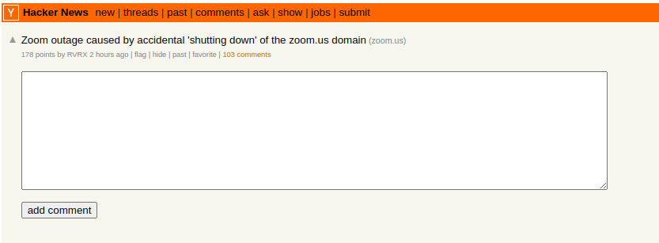
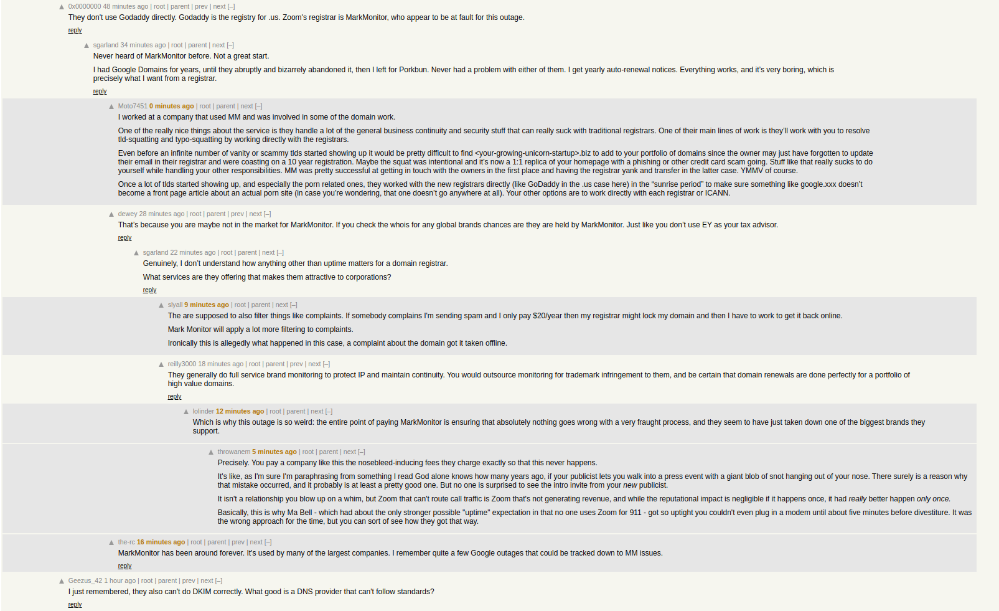
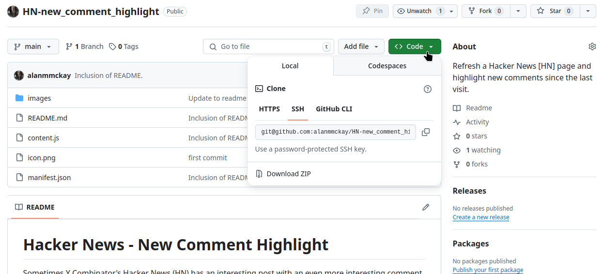
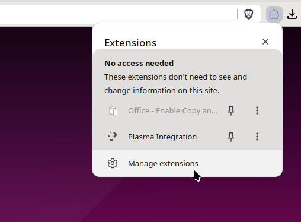
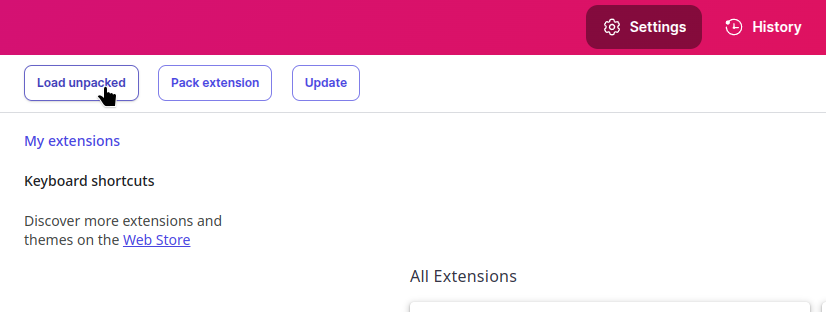
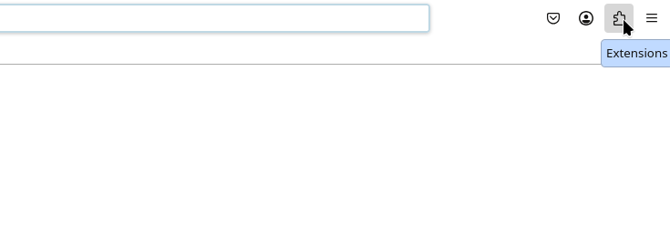
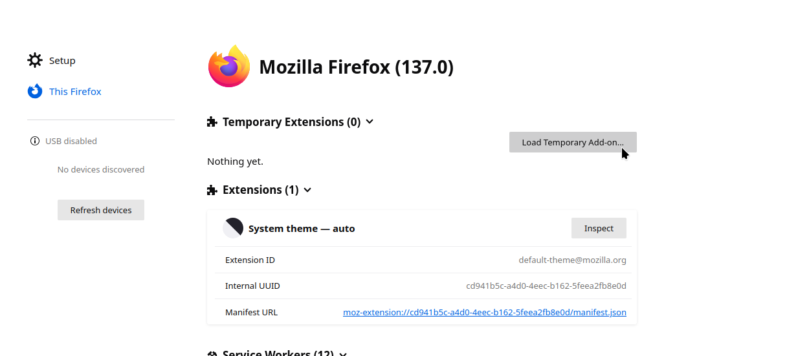

# Hacker News - New Comment Highlight

Sometimes Y Combinator's Hacker News (HN) has an interesting post with an even more interesting comment section. As discussion grows, HN places comment threads in an unpredictable manner. Navigating multiple conversations can be a bit difficult considering how comment threads are nested and might move around relative to other primary comments. This extension seeks to rectify this problem as the user revisits the page looking for new comments.

This extension works by using `chrome.storage.local` to keep track of the unix timestamps noted by HN markup. It observes the timestamp given in the initial post upon revisiting a page and takes a look at each subsequent comment's timestamp and uses this information to determine how many new comments have been made. The extension informs the user that there are new comments within the header of the primary post:

Additionally, the primary post's header has a link inserted that allows the user to jump to the first unread post. Each subsequent post will also have links embedded that allows the user to jump to the next.

The comments that have been added since a pages' last visit will also be modified to signify that it is new. This is indicated by changing the time element's font-weight and color while also setting the background color of the comment's content:

---

## How to Install

As of writing this README, this extension hasn't been added to the [Chrome Web Store](https://chromewebstore.google.com/) or [Firefox Browser Addons](https://addons.mozilla.org/en-US/firefox/). In the meantime, this extension can be side loaded into the browser of each engine. Start by downloading this repository. If not familiar with `git`, the repository can be downloaded by selecting the `< > code ` button near the top of the repository and selecting `Download ZIP`.

Extract the resultant archive using a utility such as [7zip](https://7-zip.org/download.html).

### Chromium Browsers

To install on a browser based on chromium, access the `extensions` menu and click through to `Manage extensions`.

This will open a new tab with to extension manager. Here, select the `Load unpacked` button located in the top-left of the manager.

Select the folder that was extracted from the initial zip archive.

### Gecko browsers

To install on a browser that uses the gecko engine, such as Firefox, start by accessing the extensions menu:

This will open the Add-ons Manager in a new tab. From here, select the gear icon on the right side of the page and select `Debug Add-ons` from the drop-down menu. This will open a page in a new tab for the Debugging Runtime dashboard.

Within the dashboard, select `Load Temporary Add-on` and select the zip file that was unpacked from the archive downloaded from `git`. It should be labeled something like `HN-nph-x.y.zip`.
