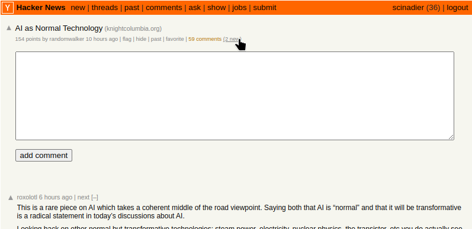
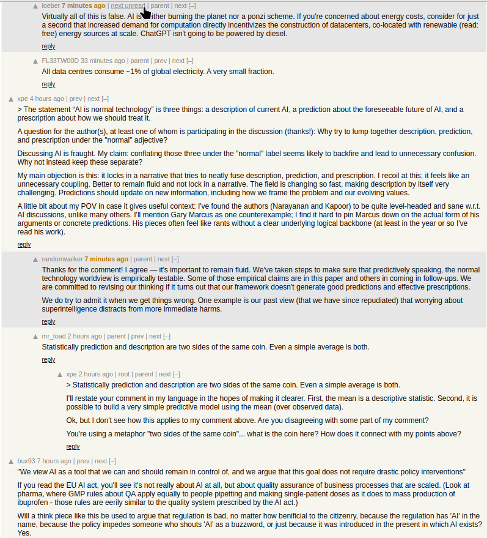

# Hacker News - New Comment Highlight

Sometimes Y Combinator's Hacker News (HN) has an interesting post with an even more interesting comment section. As discussion grows, HN places comment threads in an unpredictable manner. Navigating multiple conversations can be a bit difficult considering how comment threads are nested and might move around relative to other primary comments. This extension seeks to rectify this problem as the user revisits the page looking for new comments.

This extension works by using `chrome.storage.local` to keep track of the unix timestamps noted by HN markup. It observes the timestamp given in the initial post upon revisiting a page and takes a look at each subsequent comment's timestamp and uses this information to determine how many new comments have been made. The extension informs the user that there are new comments within the header of the primary post:

Additionally, the primary post's header has a link inserted that allows the user to jump to the first unread post. Each subsequent post will also have links embedded that allows the user to jump to the next.

The comments that have been added since a pages' last visit will also be modified to signify that it is new. This is indicated by changing the time element's font-weight and color while also setting the background color of the comment's content:

